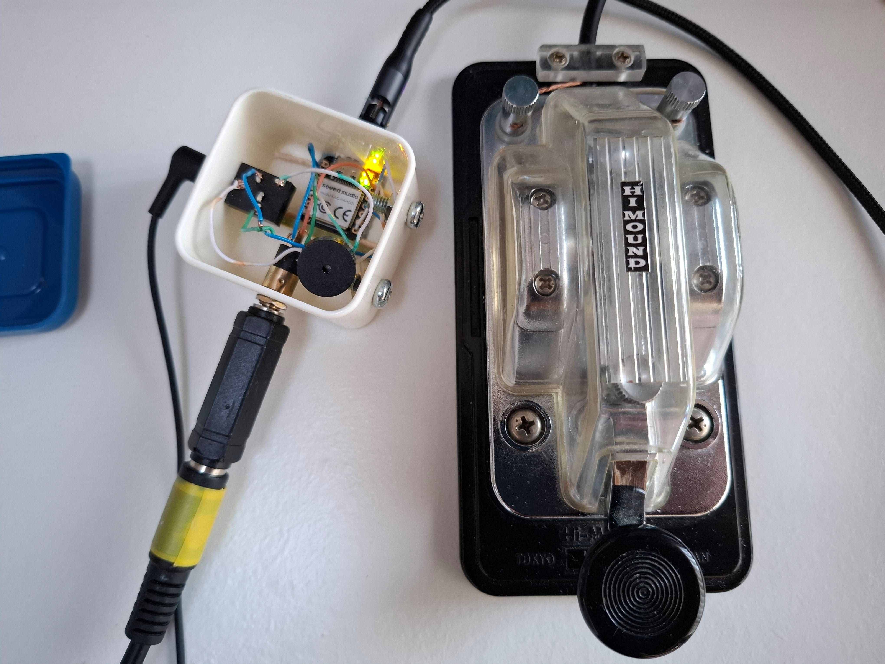
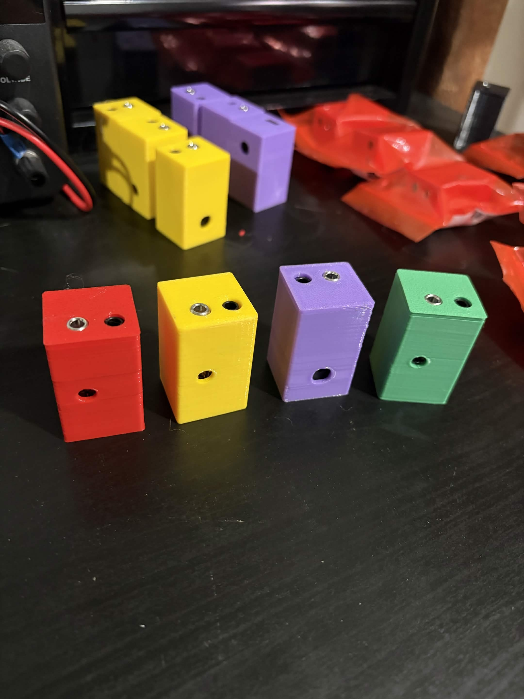

# Vail Adapter: Morse Code Key / Paddle to USB

  
  &nbsp;&nbsp;
  

The Vail Adapter is a small USB gadget that turns your Morse key or paddle into a USB device. It shows up as both a keyboard and a MIDI device, so it works with [Vail](https://vail.woozle.org/), [VBand](https://hamradio.solutions/vband/), and pretty much any CW software. The keyer logic and the sidetone run on the adapter itself, so there is no browser or operating system latency in your keying, even when you are running fast. It works on SAMD21 boards (the Seeed XIAO, the Adafruit QT Py, and the TRRS Trinkey), and there is an experimental build for the AVR Arduino Micro.

Here is a short video that shows what it can do: [Vail Adapter benefits](https://www.youtube.com/watch?v=XQ-mwdyLkOY) (4:46).

## What it does

* With Vail you can keep keying even when the Vail window is not focused, because Vail uses MIDI and MIDI does not care which window has focus
* Keyboard based apps like VBand work too, but their window has to stay focused, since keyboard presses only reach the window that is focused
* Runs all nine Vail keyer modes on the adapter, so you can key as fast as you want with no latency
* Has an optional sidetone generator, which helps with latency and lets you turn off your computer speaker
* Plays the received signal on the adapter so you can keep the computer quiet
* Stores CW memories: three slots, about 25 seconds each on SAMD21, and about 12 seconds each on the Arduino Micro
* Can key a radio directly through the optional radio output on the Advanced PCB
* Can be set up over MIDI for speed, tone, keyer type, and mode (see [MIDI integration](#midi-integration))
* Gets free firmware updates for life

## Where to get one

If you would rather not build your own, I sell them at [shop.ke9bos.com](https://shop.ke9bos.com). You can get a bare PCB, a full kit with everything you need, or a finished unit that is ready to plug in.

If you want to special order parts, place a bulk order, or you have a question about anything Vail related, email me at ke9bos@pigletradio.org and I will take care of you.

## Updating the firmware

You can flash the latest firmware right from your browser (Chrome, Edge, or Opera) at [update.vailadapter.com](https://update.vailadapter.com). Choose your board, pick a version, and follow the steps on the page. Every firmware version is posted on the [releases page](https://github.com/Vail-CW/vail-adapter/releases).

## First time setup

Once you have flashed an adapter, the first thing to do is run the getting started tool at [vailadapter.com/gettingstarted](https://vailadapter.com/gettingstarted). It walks you through getting set up and making sure everything is working.

The full manual is on the website at [vailadapter.com/manual](https://vailadapter.com/manual). It covers the buttons, the keyer modes, the memories, and the rest of the day to day use.

## Building your own

Step by step assembly guides for both boards are on the website at [vailadapter.com/assembly](https://vailadapter.com/assembly), and the PDFs are kept in this repo too: [Basic PCB v2](online-updater/assembly/BasicPCBV2.pdf) and [Advanced](online-updater/assembly/AdvancedAdapterAssemblyInstructions.pdf). If you would rather not source parts and solder, you can get a kit or a finished unit from [shop.ke9bos.com](https://shop.ke9bos.com).

The board designs (KiCad and gerbers) and the printable cases are in [hardware/](hardware/), organized by variant.

### Basic PCB (v2)

* Seeed Studio XIAO SAMD21 (from [Amazon](https://www.amazon.com/gp/product/B08CN5YSQF?smid=A2OY3Y9CEYQQ5W)) or an [Adafruit QT Py SAMD21](https://www.adafruit.com/product/4600)
* A buzzer speaker
* A [PCB mount TRS connector](https://a.co/d/bLaRwym)
* A [switched PCB mount aux jack](https://www.amazon.com/dp/B07WR748JS)

You can order the bare PCB from JLCPCB or PCBWAY yourself, or get a bare board, a kit, or an assembled unit from [shop.ke9bos.com](https://shop.ke9bos.com).

### Advanced PCB

The Advanced PCB does everything the Basic does and adds a radio output, so you can key a rig directly, along with capacitive touch points. It uses more parts than the Basic build:

* Seeed Studio XIAO SAMD21 or an Adafruit QT Py SAMD21
* A buzzer speaker
* The Advanced Vail Adapter PCB
* 1 switching aux jack and 2 standard aux jacks
* 2 transistors and 2 resistors, which drive the radio output
* 2 screw terminal PCB mounts
* 2 headers for the Arduino

The radio output parts are easy to get wrong when you buy them one at a time, so most people get the Advanced build as a kit or assembled from [shop.ke9bos.com](https://shop.ke9bos.com). The full build steps are in the [Advanced assembly guide](online-updater/assembly/AdvancedAdapterAssemblyInstructions.pdf).

### Without a PCB

* Seeed Studio XIAO SAMD21 (or an Adafruit QT Py SAMD21)
* A buzzer speaker
* A [panel mount aux jack](https://www.amazon.com/dp/B01C3RFHDC)

### Vail Lite, the USB stick version

* An [Adafruit TRRS Trinkey M0](https://www.adafruit.com/product/5954), which is a USB stick sized board with a TRRS jack built in
* A piezo buzzer, connected through the STEMMA QT connector
* It has no buttons, no capacitive touch, no headphone jack, and no radio output, so you change settings over MIDI
* Full instructions are in [TRRS_TRINKEY_BUILD.md](docs/TRRS_TRINKEY_BUILD.md)

### Arduino Micro (experimental)

This is a 5V AVR alternative to the SAMD21 boards. It is for DIY and breadboard builds only, and there is no PCB made for it.

* Wiring: D2 is Dit, D1 is Dah, D0 is the Straight Key, D10 is the Piezo, and GND is ground. There is a full walkthrough in [docs/advanced-install.md](docs/advanced-install.md).
* A few things it cannot do compared to the SAMD21 boards: no capacitive touch, no button menu, and no status LEDs. The CW memories are shorter at about 12 seconds each, and the radio output on A2 and A3 runs at 5V, so check that your radio can handle it or use a level shifter.
* Flashing is different too. It uses WebSerial with the AVR109 (Caterina) bootloader instead of UF2 drag and drop. Flash it at [update.vailadapter.com](https://update.vailadapter.com) by choosing DIY No PCB and then Arduino Micro in Chrome, Edge, or Opera, or run `arduino-cli upload --fqbn arduino:avr:micro`.

## Setting it up

* [Easy Setup](docs/easy-install.md)
* [Advanced Setup](docs/advanced-install.md)
* [See some that other people have built](https://github.com/Vail-CW/vail-adapter/wiki#cool-people-who-have-built-one)

The full manual is at [vailadapter.com/manual](https://vailadapter.com/manual).

## MIDI integration

The adapter is a standard USB MIDI device. Software can set the mode, the speed, the sidetone, and the keyer type, and it can read the keyed output as MIDI notes. The whole protocol, including the message types, the value ranges, and exactly how the firmware responds, is written up in [MIDI_INTEGRATION_SPEC.md](docs/MIDI_INTEGRATION_SPEC.md). If you are building something that talks to the adapter, follow that document closely, because I keep the existing MIDI commands the same on purpose. There is more about that just below.

## Contributing

I am glad to have help with this project. If you have a question, want parts, or want to talk through an idea, email me at ke9bos@pigletradio.org. If the adapter has been useful to you and you want to support more work on it, you can [buy me a coffee](https://buymeacoffee.com/ke9bos).

### Guidelines

The Vail Adapter has one job and it does it well. It is a simple, reliable, low latency bridge from a Morse key or paddle to USB. A lot of people, and a lot of outside tools, already count on the way it works today, so I review changes with that in mind. Here is what I ask:

1. Do not change the existing MIDI commands. The MIDI commands that are already there, for mode, speed, tone, keyer selection, and the dit, dah, and straight key notes the adapter sends, are something other tools and the Vail and VBand sites depend on. The commands, the value ranges, and the note numbers need to stay exactly as they are. I am happy to look at new MIDI commands, as long as they use messages that are not already being used and they do not change or interfere with anything that already works. If you add one, update the MIDI spec to match.

2. Keep it backward compatible. Do not break the things people already rely on, like the keyboard output (Dit is Left Control and Dah is Right Control), starting up in keyboard mode, saved settings, or the USB keyboard and MIDI interfaces. If you change how settings are stored, make sure the settings people already have still load.

3. Keep it fast. The reason this thing exists is lag free keying. Do not add anything that slows down the path from the paddle to the output. If a feature needs heavy work, do that work somewhere other than the keying loop.

4. Keep it focused. This is a key and paddle adapter. It does keying, keyer modes, sidetone, CW memories, and the optional radio output. Bigger ideas like a display, WiFi, logging, or training games belong on the Vail Summit, not here.

5. Add new hardware without disturbing the old. If you add support for a new board, put it behind a setting in config.h so the boards that already work keep behaving exactly the same. The Arduino Micro support is a good example of this.

6. Make sure every board still builds. A change should not fix one board by breaking another. Check that all of the configurations still compile before you send it.

7. Watch the limits of the chips. There is not a lot of room to spare, especially on the Arduino Micro. New features have to fit without using up the headroom on the boards that already work.

8. Do not change the defaults without a good reason. The default keyer, speed, tone, and startup mode are what people expect when they turn it on. Changing them catches people off guard.

9. Add to it rather than change it. When you can, add a new mode, command, or setting instead of changing how an existing one behaves.

10. Talk to me before any big change. For a large rewrite or a whole new feature, open an issue or send me an email first so we can make sure it fits where the project is going.

## License and credits

* License: MIT. See [LICENSE.md](LICENSE.md).
* Originally written by Neale Pickett. Currently maintained by Brett Hollifield, KE9BOS.
* Contact: ke9bos@pigletradio.org
