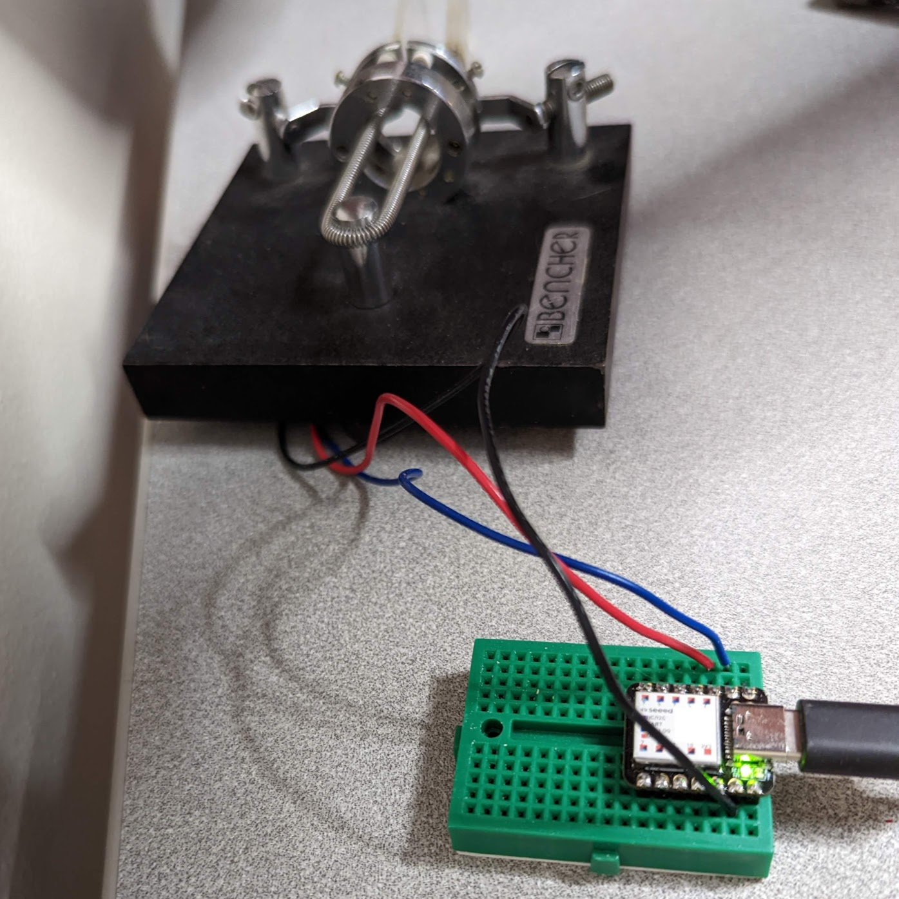

# Vail Adapter — Morse Code Key / Paddle to USB

A tiny USB adapter that turns a Morse key or paddle into a USB device — both a
**keyboard** (for [Vail](https://vail.woozle.org/), [VBand](https://hamradio.solutions/vband/),
and any CW app) and a **MIDI** controller. The keyers and sidetone run on the
adapter itself, so there's **no browser/OS latency** in your keying, even at high
speeds. Runs on SAMD21 boards (Seeed XIAO, Adafruit QT Py, TRRS Trinkey) and,
experimentally, the AVR Arduino Micro.

▶ [Vail Adapter benefits video](https://www.youtube.com/watch?v=XQ-mwdyLkOY) (4:46)

## Features

- Keys reliably even when another window has focus (HID keyboard output)
- Works with **Vail** and **VBand** (VBand needs its window focused)
- All nine Vail keyer modes run **in the adapter** — zero-latency keying at any speed
- Optional **sidetone** generator (helps with latency and lets you mute the PC speaker)
- Plays **received** signals on the adapter so you can silence your computer
- **CW memories** — 3 slots (×25 s on SAMD21; ×~12 s on Arduino Micro)
- Optional **radio output** for directly keying a rig (Advanced PCB)
- **MIDI control** of speed, tone, keyer type, and mode — see [MIDI integration](#midi-integration)
- Free firmware updates for life — flash in the browser at **[vailadapter.com](https://vailadapter.com)**

## Updating firmware

Flash the latest firmware right from your browser (Chrome/Edge/Opera) at
**[vailadapter.com](https://vailadapter.com)** — pick your board, choose a version,
and follow the steps. Firmware for every release is published as
[GitHub Release](https://github.com/Vail-CW/vail-adapter/releases) assets.

## Hardware

### PCB version
- Seeed Studio **XIAO SAMD21** ([Amazon](https://www.amazon.com/gp/product/B08CN5YSQF?smid=A2OY3Y9CEYQQ5W)) or **[Adafruit QT Py SAMD21](https://www.adafruit.com/product/4600)**
- PCB: order bare from JLCPCB/PCBWAY yourself, or get a bare board / full kit / assembled unit from Brett KE9BOS — email ke9bos@pigletradio.org
- Buzzer speaker
- For the v1.1 PCB (purple) you need both of these (v1 black PCB needs only the first):
  - [PCB-mount TRS connector](https://a.co/d/bLaRwym)
  - [Switched PCB-mount aux jack](https://www.amazon.com/dp/B07WR748JS)

### No-PCB / DIY
- Seeed Studio XIAO SAMD21 (or Adafruit QT Py SAMD21)
- Buzzer speaker
- [Panel aux jack](https://www.amazon.com/dp/B01C3RFHDC)

### Vail Lite — ultra-compact USB stick
- [Adafruit TRRS Trinkey M0](https://www.adafruit.com/product/5954) — a USB-stick board with a built-in TRRS jack
- Piezo buzzer (via the STEMMA QT connector)
- **No** buttons, capacitive touch, headphone jack, or radio output — settings are changed over MIDI only
- See **[TRRS_TRINKEY_BUILD.md](TRRS_TRINKEY_BUILD.md)**

### Experimental — Arduino Micro (ATmega32U4)
A 5 V AVR alternative to the SAMD21 boards. DIY/breadboard only — there is no Micro-targeted PCB.
- **Wiring:** D2 = Dit, D1 = Dah, D0 = Straight Key, D10 = Piezo, GND = ground. Full walkthrough → **[doc/advanced-install.md](doc/advanced-install.md#arduino-micro--notes-and-build)**
- **Limitations vs. SAMD21:** no capacitive touch, no button menu, no LEDs; CW memories shortened to 3 × ~12 s; radio output on A2/A3 is 5 V logic (check your rig's tolerance or use a level shifter)
- **Flashing:** WebSerial + AVR109 (Caterina bootloader) — no UF2 drag-and-drop. Flash at [vailadapter.com](https://vailadapter.com) (DIY No PCB → Arduino Micro) in Chrome/Edge/Opera, or run `arduino-cli upload --fqbn arduino:avr:micro`

## Setting up

- [Easy Setup](doc/easy-install.md)
- [Advanced Setup](doc/advanced-install.md)
- [Examples others have built](https://github.com/Vail-CW/vail-adapter/wiki#cool-people-who-have-built-one)

## MIDI integration

The adapter is a class-compliant USB MIDI device. Apps and tools can control
mode, speed, sidetone, and keyer type, and read the keyed output as MIDI notes.
The full protocol — message types, value ranges, and the exact firmware behavior
— is documented in **[MIDI_INTEGRATION_SPEC.md](MIDI_INTEGRATION_SPEC.md)**.

If you're building a tool against the adapter, treat that spec as the contract:
the existing MIDI commands are kept stable on purpose (see the guidelines below).

## Contributing

Contributions are welcome! For PCBs, kits, or questions, email ke9bos@pigletradio.org.
If this project is useful to you, you can [buy me a coffee](https://buymeacoffee.com/ke9bos) ☕.

### Project guidelines

The Vail Adapter has one job: be a **rock-solid, low-latency bridge from a Morse
key/paddle to USB**. Lots of people and tools already depend on exactly how it
behaves today, so contributions are reviewed against these guidelines to keep the
adapter true to that purpose and easy to maintain:

1. **Don't change existing MIDI commands.** The current MIDI map — mode, speed,
   tone, keyer select, and the dit/dah/straight note output — is a public
   contract that external tools and the Vail/VBand sites rely on. Existing
   commands, value ranges, and note numbers **must not change**. New MIDI commands
   are welcome *only* if they use currently-unused messages and do not alter or
   interfere with existing behavior — and the spec must be updated to match.

2. **Backward compatibility comes first.** Don't break behavior people rely on:
   keyboard output (dit = Left Ctrl, dah = Right Ctrl), the default boot mode
   (keyboard), saved settings, or the USB HID/MIDI interfaces. EEPROM layout
   changes must keep existing saved settings working (or migrate them).

3. **Latency is the whole point.** Never add anything that slows the key path
   (paddle → output). Keep the hot loop tight; do expensive work elsewhere.

4. **Stay in scope.** This is a keyer/paddle adapter: keying, keyers, sidetone,
   CW memories, and optional radio output. Features outside that — displays,
   WiFi, logging, training games — belong in the Vail Summit, not here. Resist
   scope creep and added complexity.

5. **New hardware support must be additive and gated.** Put new boards/variants
   behind a `config.h` selection (with `#if defined(...)` guards) so existing
   boards behave identically. The Arduino Micro port is the model — SAMD21 users
   saw zero change.

6. **Every hardware target must still build.** A change can't fix one board by
   breaking another. Make sure all configurations compile (CI builds the full
   matrix; the build kit builds them all locally).

7. **Respect the MCU limits.** Headroom is tight, especially on the AVR
   (32 KB flash / 2.5 KB RAM / 1 KB EEPROM). New features must fit without
   regressing memory on existing targets.

8. **Don't change defaults casually.** Default keyer, speed, tone, and startup
   mode are user-facing expectations — changing them surprises existing users.

9. **Prefer opt-in over altering existing behavior.** Add a new mode, command, or
   setting rather than changing how an existing one works.

10. **Discuss large changes first.** For big refactors or new subsystems, open an
    issue or email before writing code so it can be steered to fit the project.

## License & credits

- **License:** MIT — see [LICENSE.md](LICENSE.md)
- **Authors:** Neale Pickett (original) and Brett Hollifield KE9BOS (current maintainer)
- **Contact:** ke9bos@pigletradio.org
